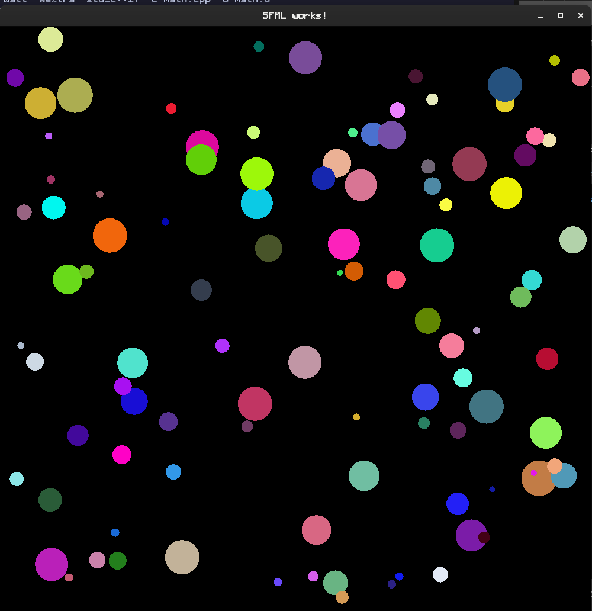
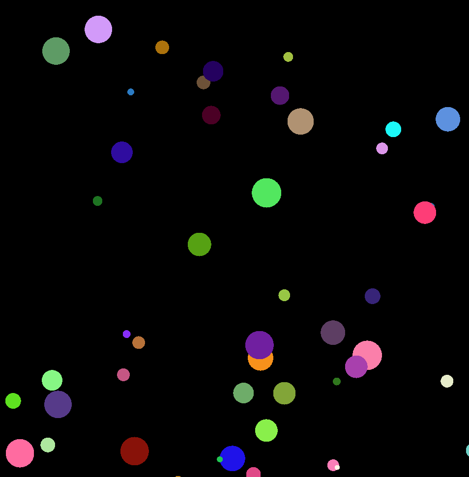
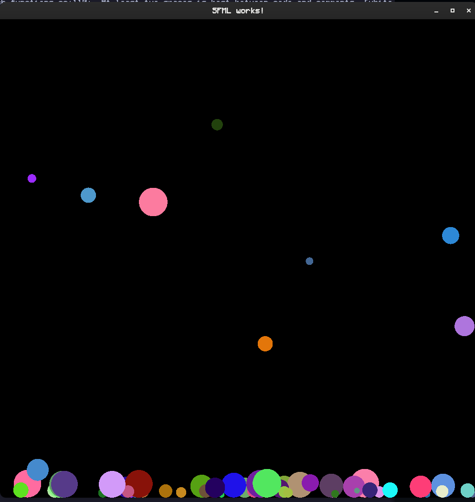

# BouncyBallSimulator
This is a simple C++ project using SFML to simulate randomly colored bouncy balls with random velocities / gravity values in a small window.

Do what you want with the code. I plan to add various features when I feel like it.

## 🎮 Controls
🖱️ **Left Click** → Spawn a new ball at your mouse location  

## 📦 Installation & Running
### **Download ZIP**
Simply download the zip, unzip it, and then run 
```sh
make
./ball_sim
```
### **Clone the Repository**
```sh
git clone https://github.com/YOUR_GITHUB_USERNAME/BouncyBalls.git
cd BouncyBalls 

make
./ball_sim

```
## Planned Features:
1. MAYBE maximum ball count on screen so I can add collision
2. Animations for spawning balls / hitting the sides
3. Different ball "materials" with designated texture files but still random colors
4. UI to clear balls / change gravity / force ball material
5. Particle effects

## Demo Images
-- No Gravity -- 

-- Gravity --

-- 0 Velocity --

